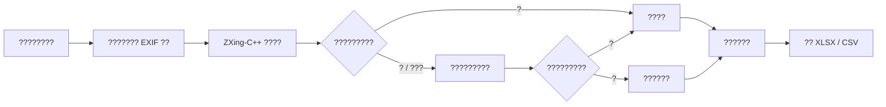

# Water Meter Barcode Reader

[](https://github.com/icenturyw/water-meter-barcode-reader/actions/workflows/ci.yml)
[](https://www.python.org/)
[](https://www.microsoft.com/windows)
[](https://github.com/icenturyw/water-meter-barcode-reader/releases/latest)
[](LICENSE)

> ????????????????????????????????????????? Excel / CSV?

?????? Windows ?????????????? ZXing-C++ ?????????????????????????????????????????????????????????????

??????????????????????????????????

## ????



??????? `core.py` ??????????????????????????????????????????????????????

## ????

- ?????????????????????
- ?? JPG?JPEG?PNG?BMP?TIFF?WebP
- ???? EXIF ??
- ?? ZXing-C++ ???????????????????? Code 128
- ?????????????????????
- ???????????????????????
- ?????????????????????????????????
- v1.0.1 ?????????????????????????
- ??????????????????????????????????
- ??????????????????????
- ??????????????????
- ?? XLSX ? UTF-8-SIG CSV
- XLSX ??????????????
- ??? XLSX ????????????????????????

## ????

- ??????
- ??????
- ??????????
- ?? / ???????????
- ??????????? Excel ??

????????**??????**?????????????? OCR ??????????????

## ????

- Windows x64
- Python 3.11?3.13 x64
- Python ????? Tcl/Tk

?????

- `zxing-cpp`?????
- `Pillow`?????????
- `openpyxl`?XLSX ??
- `tkinter`??? GUI
- `PyInstaller`?Windows ?????

## ????

???????

```powershell
py -3.13 -m venv .venv
```

?????

```powershell
.\.venv\Scripts\python.exe -m pip install -r requirements.txt
```

?????

```powershell
.\.venv\Scripts\python.exe app.py
```

## ?????

????????????? JSON???????????????????

```powershell
.\.venv\Scripts\python.exe app.py --self-test "D:\??\??001.jpg" --length 14
```

## ????

```powershell
.\.venv\Scripts\python.exe -m unittest discover -s tests -v
```

?????

- Code 128 ????
- ?????
- ??????
- ??????
- ??????
- ??????????
- ??????
- XLSX ??????

## ?? Windows ???

```powershell
powershell -ExecutionPolicy Bypass -File .\build.ps1
```

????????????

```text
dist\
??? onedir\
?   ??? ??????????\
??? onefile\
    ??? ??????????.exe
```

- `onedir`?????????????????????????
- `onefile`??????????????????????

???????? Python?Tk????? Excel ?????????? Python???????

?????????????????????????????

## ????

1. ?????????????????????
2. ????????? / ??
3. ???????
4. ????????????????
5. ????????
6. ????????????????????????
7. ???????????
8. ?? Excel / CSV

?????????????? [`????.txt`](????.txt)?

## ????

- ??????
- ????????????????
- ??????????? 60% ??
- ?????????????
- ????????????????
- ??????????????
- ??????????????????????

??????????????????????????????????????????????????????? 20?50 ????????????

## ????

```text
.
??? app.py                    # Tkinter GUI??????????
??? core.py                   # ?????????????????
??? tests/
?   ??? test_core.py          # ?????????
??? build.ps1                 # PyInstaller Windows ????
??? requirements.txt          # ??????
??? THIRD_PARTY_NOTICES.txt   # ???????
??? ????.txt               # ???????????
??? README.md
```

## ???????

- ????????
- ????? OCR / API
- ??????????????????
- ??????????????? Excel / CSV

## ????

- ??????? HEIC / HEIF?????? JPG
- ????????????
- ???????? OCR ??
- ??????????????????????????
- ??????? 14 ??????????????????????

## ??

?????`v1.0.1`

????? [`CHANGELOG.md`](CHANGELOG.md)?

## License

MIT License?? [`LICENSE`](LICENSE)????????????? [`THIRD_PARTY_NOTICES.txt`](THIRD_PARTY_NOTICES.txt)?

